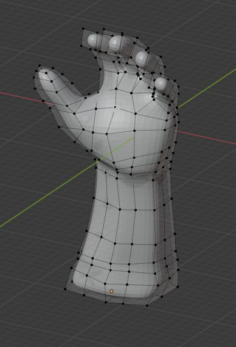

# open-hand-sim

This project aims at the development of a realistic 3d hand model including kinematics. Our main intention is to 
use this hand model in oder to generate artificial data to train a neural network to learn hand poses in 3d. However, 
the model may be freely used and could be useful for other applications as well.

This project provides two important things:
1) A 3d model (including kinematics/bones) of the human hand as Blender file
2) Python scripts to control the human hand and integrate the model with pytorch

